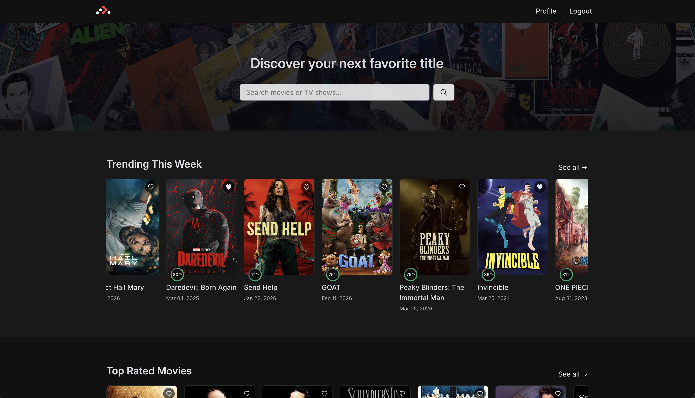
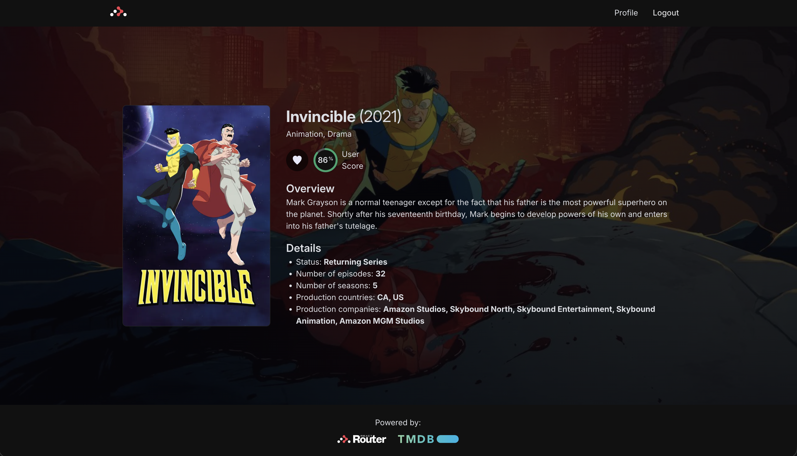
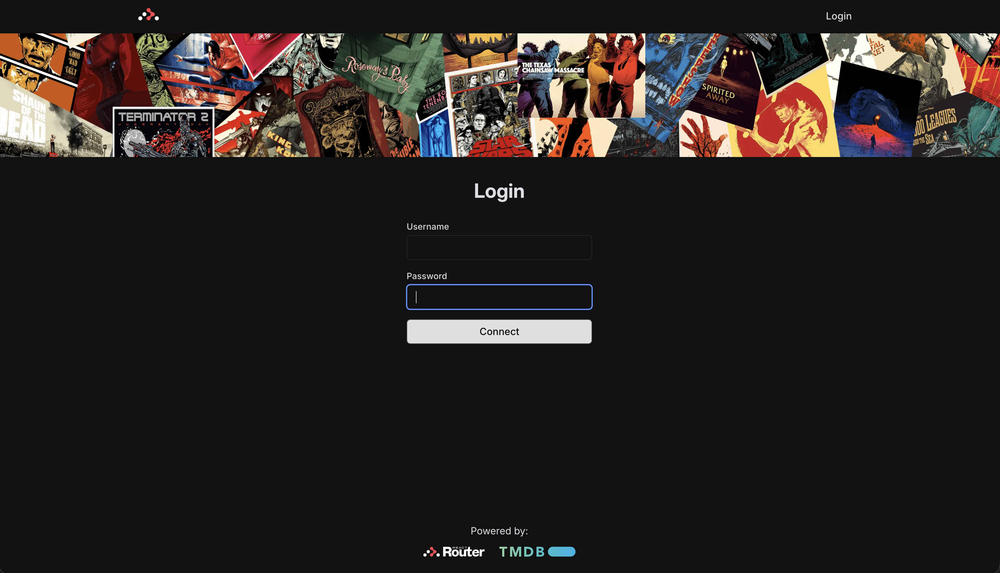
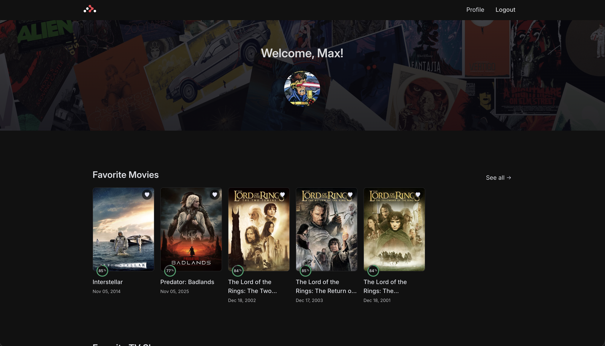

## Project Screenshots


_Home Page_


_Media Details_


_Profile Page_


_Favorites Feature_

## Architecture & Security

This project uses the **MVVM (Model-View-ViewModel)** architectural pattern:

Model <----> ViewModel <----> View
(Data & <----> (Business Logic) <----> (UI Components)
Server) (No direct access to Model from View)

- All business logic and sensitive operations are handled on the server side.
- No tokens or API keys are ever exposed to the client.
- The ViewModel acts as a secure bridge between the UI and the server, ensuring a clean separation of concerns.

## Features

- 🚀 Server-side rendering
- ⚡️ Hot Module Replacement (HMR)
- 📦 Asset bundling and optimization
- 🔄 Data loading and mutations
- 🔒 TypeScript by default

- 📖 [React Router docs](https://reactrouter.com/)

## Getting Started

### Create .env file

To run the project you'll need the following `.env` variables:

- VITE_BASE_DOMAIN=http://localhost:5173
- VITE_SESSION_SECRET=random characters string
- VITE_ACCESS_TOKEN=can be obtained here: https://developer.themoviedb.org/docs/getting-started
- VITE_API_KEY=can be obtained here: https://developer.themoviedb.org/docs/getting-started
- VITE_API_BASE_URL=https://api.themoviedb.org/3
- VITE_IMAGE_BASE_URL=https://image.tmdb.org/t/p

### Installation

Install the dependencies:

```bash
npm install
```

### Development

Start the development server with HMR:

```bash
npm run dev
```

Your application will be available at `http://localhost:5173`.

## Building for Production

Create a production build:

```bash
npm run build
```

## Deployment

### Docker Deployment

To build and run using Docker:

```bash
docker build -t my-app .

# Run the container
docker run -p 3000:3000 my-app
```

The containerized application can be deployed to any platform that supports Docker, including:

- AWS ECS
- Google Cloud Run
- Azure Container Apps
- Digital Ocean App Platform
- Fly.io
- Railway

### DIY Deployment

If you're familiar with deploying Node applications, the built-in app server is production-ready.

Make sure to deploy the output of `npm run build`

```
├── package.json
├── package-lock.json (or pnpm-lock.yaml, or bun.lockb)
├── build/
│   ├── client/    # Static assets
│   └── server/    # Server-side code
```

---

Built with ❤️ using React Router.
